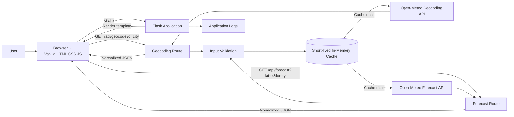
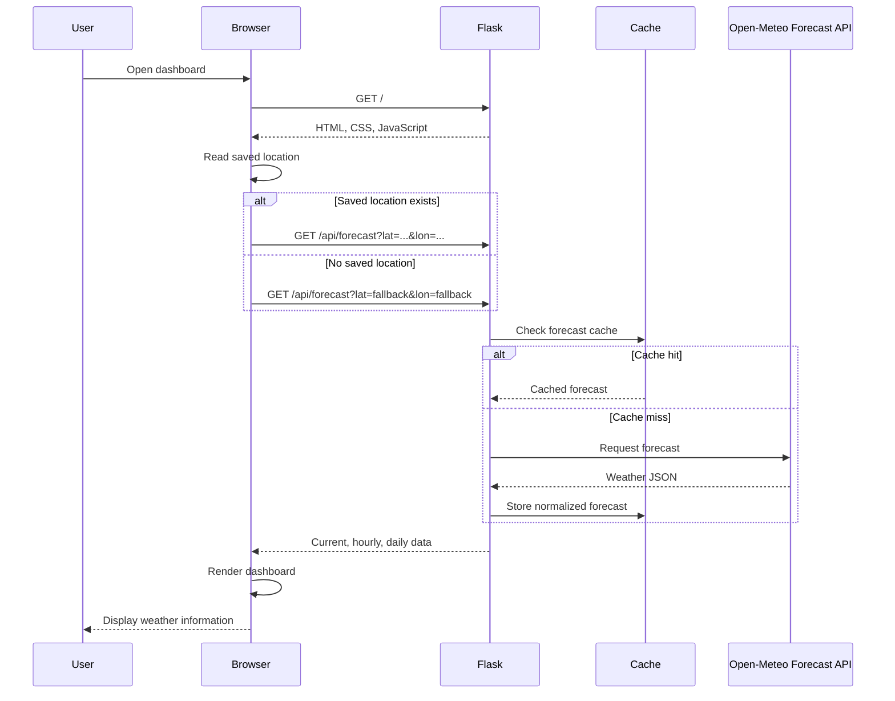
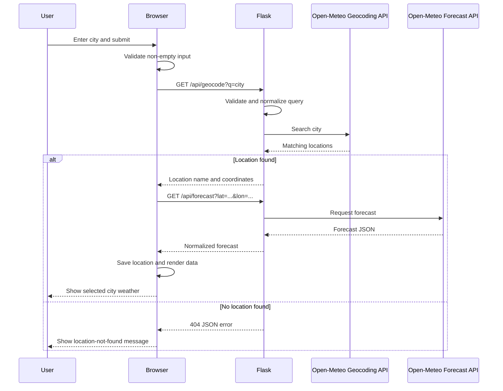
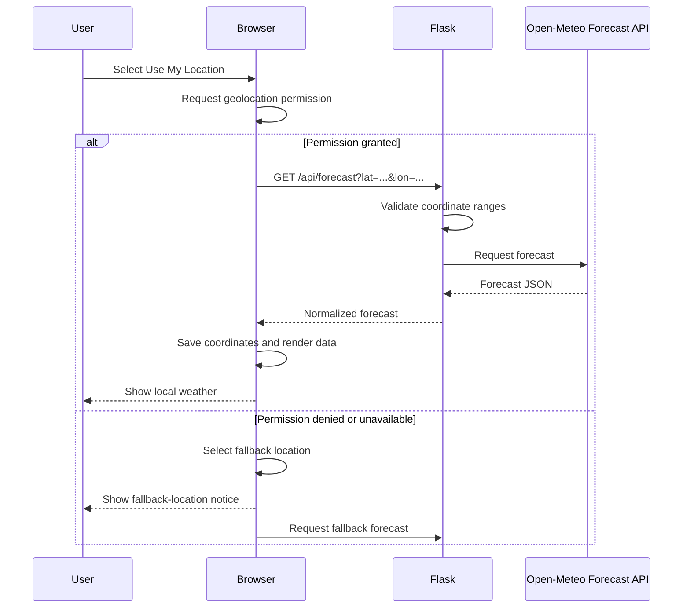

## Plan: Flask Weather Dashboard

Build a responsive vanilla HTML/CSS/JS personal weather dashboard served by Flask. The browser will call local Flask JSON endpoints, while the backend validates inputs, proxies Open-Meteo geocoding and forecast requests, and normalizes errors. No Open-Meteo API key is required.

**Steps**
1. Add `app.py`, `requirements.txt`, `templates/index.html`, `static/css/styles.css`, `static/js/app.js`, and `README.md` with virtual-environment and run instructions.
2. Implement Flask routes in `app.py`: the dashboard page, a validated city geocoding endpoint, and a validated latitude/longitude forecast endpoint. Use request timeouts and consistent JSON errors; add a small bounded cache only if it remains simple.
3. Build the accessible dashboard shell in `templates/index.html`: header, city search, use-location control, current conditions, metric summary, hourly forecast, daily forecast, and live status/error regions. The frontend must not call Open-Meteo directly.
4. Create the visual system in `static/css/styles.css`: expressive weather typography, layered sky-inspired background/pattern, navy/teal/coral/gold palette, restrained panels, responsive desktop/mobile grid, stable forecast dimensions, focus states, reduced-motion support, and loading/error states.
5. Implement `static/js/app.js` against the Flask endpoints: search, forecasts, WMO code labels/icons, API timezone formatting, rendering, browser geolocation, saved last location, stale-request protection, and useful errors.
6. Add a fallback location so the app works without geolocation permission.
7. Document setup, proxy architecture, endpoint behavior, and Open-Meteo attribution in `README.md`.
8. Validate backend routes and the complete UI locally.

**Relevant files**
- `c:\co-pilot\kpidemoapp\app.py` — Flask routes, validation, upstream requests, and errors.
- `c:\co-pilot\kpidemoapp\requirements.txt` — Python dependencies.
- `c:\co-pilot\kpidemoapp\templates\index.html` — dashboard structure and render targets.
- `c:\co-pilot\kpidemoapp\static\css\styles.css` — responsive visual language and states.
- `c:\co-pilot\kpidemoapp\static\js\app.js` — local API integration and rendering.
- `c:\co-pilot\kpidemoapp\README.md` — setup, architecture, and attribution.

**Verification**
1. Create a virtual environment, install dependencies, and run Flask in development mode.
2. Test page, geocoding, and forecast endpoints with valid and invalid inputs, including upstream failures and timeouts.
3. Confirm the fallback location renders current, hourly, and seven-day forecasts with the API timezone.
4. Search another city, rapidly submit searches, and test empty/unknown searches and geolocation denial.
5. Check desktop/mobile layout, keyboard focus, accessible labels, no horizontal overflow, and reduced-motion behavior.
6. Run Python syntax/diagnostic checks and Flask route tests; inspect the final diff.

**Decisions**
- Use Flask and a backend proxy because the user selected both.
- Keep the frontend framework-free and use Open-Meteo without an API key.
- Include geolocation and city search with a non-personal fallback location.
- Exclude accounts, persistence, severe-alert aggregation, maps, and paid providers.

**Further Considerations**
1. Prefer Python's standard library HTTP client unless a declared dependency materially improves timeout/error handling.
2. Use inline symbols plus accessible text rather than an icon dependency to keep deployment portable.

## Architecture Diagram



## Data Flow: Initial Dashboard Load



## Data Flow: City Search



## Data Flow: Device Location



## Normalized API Response

The backend should normalize provider responses into a stable frontend shape:

```json
{
  "location": {
	"name": "London",
	"latitude": 51.5072,
	"longitude": -0.1276,
	"timezone": "Europe/London"
  },
  "current": {
	"temperature": 18.4,
	"feels_like": 17.9,
	"condition": "Partly cloudy",
	"weather_code": 2,
	"humidity": 72,
	"wind_speed": 12.5,
	"precipitation": 0
  },
  "hourly": [],
  "daily": []
}
```

Errors should use one consistent format:

```json
{
  "error": {
	"code": "LOCATION_NOT_FOUND",
	"message": "We could not find that city."
  }
}
```

## Component Responsibilities

| Component | Responsibility |
|---|---|
| Browser UI | Displays weather data and handles user interactions |
| `templates/index.html` | Provides the dashboard markup |
| `static/css/styles.css` | Provides responsive visual styling |
| `static/js/app.js` | Calls Flask endpoints and renders results |
| Flask application | Serves the UI and exposes backend API routes |
| Validation layer | Validates city names and coordinate ranges |
| Cache | Reduces repeated upstream requests |
| Open-Meteo Geocoding API | Converts city names into coordinates |
| Open-Meteo Forecast API | Provides current, hourly, and daily weather |
| Error handler | Converts failures into consistent JSON responses |

## Architecture Decisions

- The browser communicates only with Flask.
- Flask owns provider access, validation, normalization, timeouts, and errors.
- City searches use geocoding before forecast retrieval.
- The frontend owns presentation and last-location browser storage.
- A fallback location keeps the dashboard usable when geolocation is denied.
- Stale frontend requests must be ignored so older responses cannot replace newer searches.

## Recommended Folder Structure

Use this structure for the first version:

```text
kpidemoapp/
├── app.py
├── requirements.txt
├── README.md
├── .gitignore
│
├── templates/
│   └── index.html
│
├── static/
│   ├── css/
│   │   └── styles.css
│   └── js/
│       └── app.js
│
└── tests/
	└── test_app.py
```

### File Responsibilities

- `app.py`: Flask application, routes, validation, Open-Meteo proxy calls, caching, and error handling.
- `requirements.txt`: Flask and backend dependencies.
- `templates/index.html`: Dashboard HTML rendered by Flask.
- `static/css/styles.css`: Responsive layout, colors, typography, loading, and error states.
- `static/js/app.js`: Search, geolocation, Flask API calls, local storage, and UI rendering.
- `tests/test_app.py`: Flask route, validation, and error-handling tests.
- `README.md`: Setup, run instructions, API documentation, and Open-Meteo attribution.
- `.gitignore`: Excludes the virtual environment, Python cache files, test artifacts, and secrets.

### Growth Structure

Keep `app.py` as a single backend module initially. If the application grows, split the backend while preserving the same public routes:

```text
kpidemoapp/
├── app/
│   ├── __init__.py
│   ├── routes.py
│   ├── weather_service.py
│   ├── validators.py
│   └── cache.py
├── templates/
├── static/
└── tests/
```

- `app/__init__.py`: Application factory and Flask configuration.
- `app/routes.py`: Page and JSON API routes.
- `app/weather_service.py`: Open-Meteo requests and response normalization.
- `app/validators.py`: City and coordinate validation.
- `app/cache.py`: Short-lived forecast and geocoding cache behavior.
